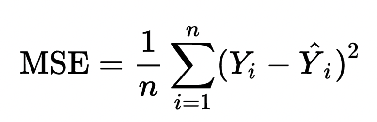
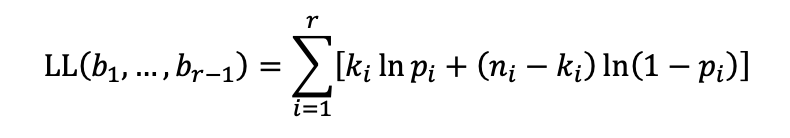

***Bucket FICO scores***

Problem Statement:
Charlie wants to make her model work for future data sets, so she needs a general approach to generating the buckets. Given a set number of buckets corresponding to the number of input labels for the model, she would like to find out the boundaries that best summarize the data. You need to create a rating map that maps the FICO score of the borrowers to a rating where a lower rating signifies a better credit score.

The process of doing this is known as quantization. You could consider many ways of solving the problem by optimizing different properties of the resulting buckets, such as the mean squared error or log-likelihood (see below for definitions). For background on quantization.

Mean squared error
You can view this question as an approximation problem and try to map all the entries in a bucket to one value, minimizing the associated squared error. We are now looking to minimize the following:
 

Log-likelihood
A more sophisticated possibility is to maximize the following log-likelihood function:

Where bi is the bucket boundaries, ni is the number of records in each bucket, ki is the number of defaults in each bucket, and pi = ki / ni is the probability of default in the bucket. This function considers how rough the discretization is and the density of defaults in each bucket. This problem could be addressed by splitting it into subproblems, which can be solved incrementally (i.e., through a dynamic programming approach). For example, you can break the problem into two subproblems, creating five buckets for FICO scores ranging from 0 to 600 and five buckets for FICO scores ranging from 600 to 850.

**What I DId:**
I implemented a data-driven credit scoring system by segmenting borrowers into FICO score buckets and estimating default probabilities. I applied *K-Means clustering* to define initial buckets and refined them using *Dynamic Programming* to optimize PD prediction. For each bucket, I calculated observed default rates, predicted PDs, and validated the model using *mean squared error (MSE) and log-likelihood*. Predicted PDs were mapped back to individual borrowers, providing granular risk assessment. I visualized results with bar plots showing PD per bucket and FICO score ranges. This task combined unsupervised learning, optimization, and statistical validation, enhancing skills in clustering, risk segmentation, probability estimation, and visualization for financial datasets.
